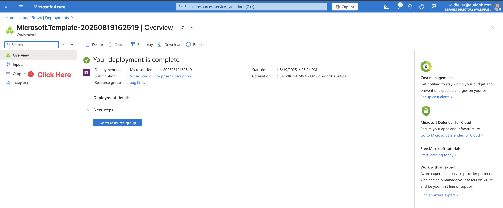
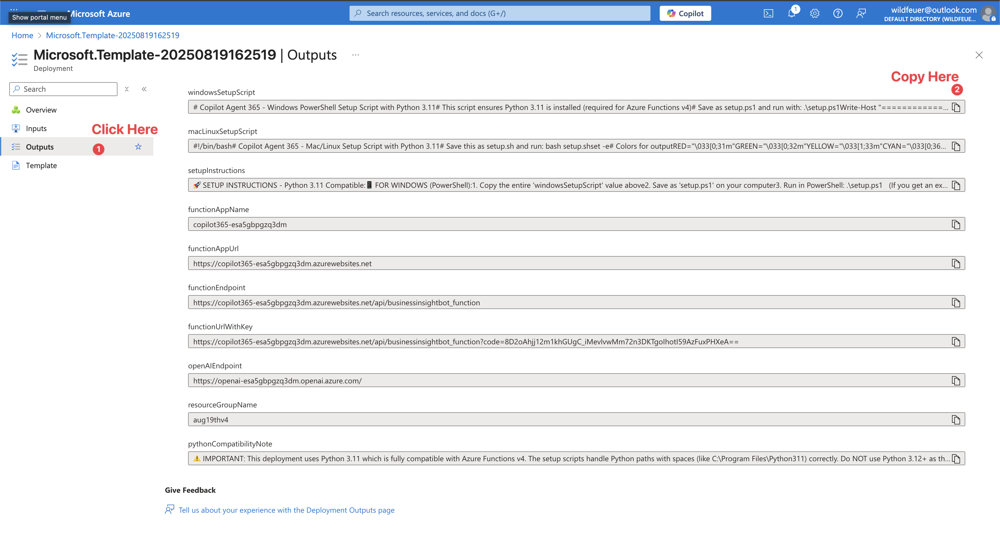

# Rapid Agent Prototyping Platform (RAPP) - Self-Evolving AI Assistant Framework

## 🧬 Revolutionary AI System That Learns New Capabilities Through Conversation

RAPP represents a breakthrough in AI assistant technology - a platform where AI assistants can dynamically acquire new skills and capabilities without code deployment or system restarts. Unlike traditional static chatbot systems that require developer intervention for new features, RAPP enables AI assistants to literally teach themselves new abilities through natural conversation.

## 🎯 Core Innovation

This platform solves the fundamental limitation of current AI systems: **static functionality**. Traditional chatbots ship with fixed capabilities and require engineering teams to add features. RAPP introduces a paradigm shift where:

- **Dynamic Capability Acquisition**: AI learns and implements new skills in real-time
- **Zero-Deployment Updates**: New agents are loaded from cloud storage without restarts
- **Conversational Programming**: Users can describe desired functionality in natural language
- **Persistent Skill Memory**: Learned capabilities persist across sessions and users
- **Multi-Tier Context System**: Separates shared knowledge from user-specific contexts

## 🚀 One-Click Setup - Fully Automated!

### Step 1: Deploy to Azure (1 minute)
[](https://portal.azure.com/#create/Microsoft.Template/uri/https%3A%2F%2Fraw.githubusercontent.com%2Fkody-w%2FCopilot-Agent-365%2Fmain%2Fazuredeploy.json)

### Step 2: Copy & Run Setup Script (2 minutes)

After deployment completes, you'll see "Your deployment is complete" ✅

1. Click the **"Outputs"** tab on the left sidebar (see screenshots below)
2. Find and copy the entire script value:
   - **Windows users**: Copy `windowsSetupScript` 
   - **Mac/Linux users**: Copy `macLinuxSetupScript`
3. Save it as a file and run:


*First, click on "Outputs" in the left sidebar*


*Then copy your platform's setup script*

**Windows (PowerShell):**
```powershell
.\setup.ps1
```
If you get a security error, first run: `Set-ExecutionPolicy RemoteSigned -Scope CurrentUser`

**Mac/Linux (Terminal):**
```bash
bash setup.sh
```

**That's it!** Your AI assistant is now running both in Azure and locally with all settings automatically configured. 🎉

---

## 🔬 Patent-Pending Innovations

### 1. Dynamic Agent Learning System
The platform's most groundbreaking feature is its ability to **dynamically acquire new capabilities without code deployment**:
- Agents are loaded from Azure File Storage at runtime
- New agents can be created and deployed through conversation
- No system restarts or deployments required
- Capabilities persist and are immediately available to all users

### 2. Multi-Tier Memory Architecture
Revolutionary memory management system with intelligent context separation:
- **Shared Memory Layer**: Common knowledge accessible across all conversations
- **User-Specific Memory Layer**: Isolated contexts per unique GUID
- **Dynamic Context Switching**: Automatic memory context based on user identification
- **Persistent Skill Repository**: Learned capabilities stored permanently

### 3. Conversational Programming Interface
Users can create new functionality through natural language:
- Describe desired behavior in plain English
- System generates and stores new agent implementations
- Immediate availability without technical knowledge
- Self-modifying capability through reflection

### 4. Runtime Agent Discovery
Innovative hot-loading mechanism for capabilities:
- Scans both local and cloud storage for agents
- Dynamically imports and registers new capabilities
- No predefined agent registry required
- Supports multi-agent orchestration patterns

## ✨ Technical Architecture

- 🧠 **Azure OpenAI Integration** - Leverages latest GPT-4 models with function calling
- 💾 **Dual-Layer Memory System** - Sophisticated context management with shared and user-specific stores
- 🔄 **Hot-Reload Capability** - Runtime loading of new agents without restarts
- ⚡ **Serverless Scalability** - Azure Functions for infinite horizontal scaling
- 🎯 **Agent Orchestration** - Complex multi-agent workflows with dynamic composition
- 🔐 **Enterprise Security** - Function-level authentication with Azure AD integration

## 📋 Prerequisites

The setup script will automatically install missing components, but you'll need:

### Windows
- **Azure Account** - [Get free trial](https://azure.microsoft.com/free/)
- **PowerShell** - Already installed on Windows
- Everything else auto-installs! ✨

### Mac/Linux
- **Azure Account** - [Get free trial](https://azure.microsoft.com/free/)
- **Python 3.9-3.11** - `brew install python@3.11` (Mac) or `apt-get install python3.11` (Linux)
- **Git** - `brew install git` (Mac) or `apt-get install git` (Linux)
- **Node.js** - `brew install node` (Mac) or from [nodejs.org](https://nodejs.org/)

Then install Azure Functions Core Tools:
```bash
npm install -g azure-functions-core-tools@4
```

## 🎯 Quick Start After Setup

Once setup is complete, you can start your self-evolving AI assistant:

### Windows
```powershell
cd Rapid-Agent-Prototyping-Platform-RAPP
.\run.ps1
```

### Mac/Linux
```bash
cd Rapid-Agent-Prototyping-Platform-RAPP
./run.sh
```

Then:
- **Local API**: http://localhost:7071/api/businessinsightbot_function
- **Web Chat**: Open `client/index.html` in your browser
- **Azure URL**: Automatically shown after setup (includes auth key)

## 🧪 Experience the Self-Learning Capability

### Test Basic Interaction
```bash
curl -X POST http://localhost:7071/api/businessinsightbot_function \
  -H "Content-Type: application/json" \
  -d '{"user_input": "Hello", "conversation_history": []}'
```

### Teach Your Assistant a New Skill
Simply describe what you want in natural language:
```json
{
  "user_input": "I need you to learn how to analyze customer sentiment from reviews",
  "conversation_history": []
}
```

The assistant will create and store a new agent capability that persists for all future interactions.

## 🛠️ Dynamic Capability Extension

### Traditional Approach (Not Required with RAPP)
In traditional systems, you would need to:
1. Write code for new functionality
2. Test and debug
3. Deploy to production
4. Restart services

### RAPP Approach - Conversational Programming
Simply tell the AI what you need:
- "Create an agent that can generate weekly reports"
- "Learn how to integrate with our CRM system"
- "Develop a capability to analyze competitor data"

### Manual Agent Creation (Optional)
For complex custom logic, you can still create agents manually:
```python
from agents.basic_agent import BasicAgent

class MyCustomAgent(BasicAgent):
    def __init__(self):
        self.name = 'MyCustom'
        self.metadata = {
            "name": self.name,
            "description": "What this agent does",
            "parameters": {
                "type": "object",
                "properties": {
                    "input": {
                        "type": "string",
                        "description": "Input parameter"
                    }
                },
                "required": ["input"]
            }
        }
        super().__init__(self.name, self.metadata)
    
    def perform(self, **kwargs):
        input_data = kwargs.get('input', '')
        # Your logic here
        return f"Processed: {input_data}"
```

## 🔄 How the Self-Learning System Works

### Dynamic Capability Acquisition Flow

1. **User Request** → Natural language description of desired functionality
2. **Intent Analysis** → AI understands the requirement and identifies missing capability
3. **Agent Generation** → System creates new agent code based on requirements
4. **Runtime Deployment** → Agent is stored in Azure File Storage
5. **Immediate Availability** → New capability is instantly accessible without restart
6. **Persistent Learning** → Capability remains available for all future sessions

### Technical Implementation

#### Runtime Agent Discovery
```python
# System continuously scans for new agents
- Local folder: /agents/*.py
- Azure Storage: /agents/*_agent.py
- Multi-agent workflows: /multi_agents/*_agent.py
```

#### Memory Context Management
```python
# Dual-layer memory system
- Shared Context: Available to all users and sessions
- User Context: Isolated per GUID (c0p110t0-aaaa-bbbb-cccc-123456789abc format)
- Dynamic Switching: Automatic based on user identification
```

#### Zero-Deployment Architecture
- **No Code Commits Required**: New capabilities bypass traditional CI/CD
- **No Service Restarts**: Hot-loading without disruption
- **No Version Management**: Capabilities are additive and non-breaking
- **No Deployment Windows**: 24/7 learning and evolution

## 📁 System Architecture

```
Rapid-Agent-Prototyping-Platform-RAPP/
├── function_app.py            # Core orchestration engine with dynamic loading
├── agents/                    # Local agent repository
│   ├── basic_agent.py        # Abstract base class for all agents
│   ├── context_memory_agent.py  # Memory retrieval and management
│   └── manage_memory_agent.py   # Memory persistence operations
├── utils/
│   └── azure_file_storage.py # Dual-tier memory system implementation
├── Azure File Storage/        # Cloud-based dynamic capabilities
│   ├── agents/               # Runtime-loaded single agents
│   ├── multi_agents/         # Complex orchestration patterns
│   ├── shared_memories/      # Cross-session knowledge base
│   └── memory/{guid}/        # User-specific contexts
├── client/                    # Conversational interface
│   └── index.html
└── local.settings.json        # Auto-configured Azure bindings
```

## 🚨 Troubleshooting

| Issue | Solution |
|-------|----------|
| "Python 3.11 not found" | Script auto-installs it! Just wait 2-3 minutes |
| "C:\Program Files" error | Fixed! Script handles spaces in paths |
| "func: command not found" | Run: `npm install -g azure-functions-core-tools@4` |
| Port already in use | Edit `run.ps1` or `run.sh` and change to `func start --port 7072` |
| "az login" needed | Run `az login` to deploy code to Azure (optional) |

## 💡 Python Version Important!
- **Use Python 3.11** (automatically installed by script)
- **Don't use Python 3.13+** (causes compatibility issues with Azure Functions)
- Script specifically installs and uses Python 3.11 to avoid issues

## 💰 Cost

- **Function App**: ~$0 (free tier covers most usage)
- **Storage**: ~$5/month
- **OpenAI**: Pay per token used (~$0.01 per 1K tokens)

**Total: ~$5/month + OpenAI usage**

## 🔐 Security

- **API keys are embedded securely** in the generated setup script
- **Never commit** `local.settings.json` to Git (contains secrets)
- **Function requires authentication** key for API access
- **All traffic uses HTTPS**
- **Keys are unique** to your deployment

## 🏆 Key Differentiators

### vs. Traditional Chatbots
| Traditional Systems | RAPP Platform |
|-------------------|--------------|
| Static capabilities defined at compile time | Dynamic capability acquisition at runtime |
| Requires developer to add features | Self-learning through conversation |
| Deployment needed for updates | Zero-deployment continuous evolution |
| Fixed conversation patterns | Adaptive interaction based on learned skills |
| Single context for all users | Multi-tier context separation |

### vs. Current AI Assistants
| Current AI (ChatGPT, Copilot) | RAPP Platform |
|------------------------------|--------------|
| Session-limited memory | Persistent cross-session memory |
| Cannot learn new skills | Dynamically acquires capabilities |
| Fixed tool set | Expandable tool ecosystem |
| Requires plugins for integration | Self-integrating through learning |
| Single execution context | User-specific and shared contexts |

## 🤝 Contributing

1. Fork the repo
2. Create your feature branch (`git checkout -b feature/AmazingFeature`)
3. Commit changes (`git commit -m 'Add some AmazingFeature'`)
4. Push to branch (`git push origin feature/AmazingFeature`)
5. Open a Pull Request

## 📜 License

MIT License - See [LICENSE](LICENSE)

## 🆘 Support

- **Issues**: [GitHub Issues](https://github.com/kody-w/Copilot-Agent-365/issues)
- **Discussions**: [GitHub Discussions](https://github.com/kody-w/Copilot-Agent-365/discussions)

## 🌟 Revolutionary Impact

RAPP fundamentally transforms how AI assistants evolve and adapt:

### For Enterprises
- **Zero IT Overhead**: No deployment cycles for new capabilities
- **Instant Customization**: Business users can teach AI their specific needs
- **Knowledge Retention**: Organizational learning persists and compounds
- **Reduced Development Costs**: Eliminate the need for constant feature development

### For Developers
- **Focus on Architecture**: Build the platform, not individual features
- **Rapid Prototyping**: Test new agent concepts through conversation
- **Live Debugging**: Observe agent behavior in real-time without restarts
- **Composable Capabilities**: Combine agents for complex workflows

### For End Users
- **Natural Interaction**: Describe what you need in plain language
- **Personalized Experience**: AI remembers your context and preferences
- **Continuous Improvement**: Assistant becomes more capable over time
- **No Technical Barriers**: Create powerful automations without coding

## 🚀 Future Vision

This platform represents the foundation for truly adaptive AI systems that:
- Learn from every interaction
- Share knowledge across instances
- Evolve capabilities autonomously
- Bridge the gap between human intent and machine execution

---

<p align="center">
  <strong>Deploy the future of AI assistants in under 3 minutes!</strong>
  <br><br>
  <a href="https://github.com/kody-w/Rapid-Agent-Prototyping-Platform-RAPP">⭐ Star this repo</a> to support the project
  <br><br>
  <em>Building the bridge to self-evolving AI</em>
</p>